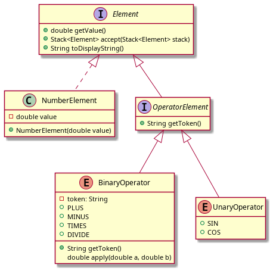

# CSc 22100 Spring 2022 Assignment 3: RPN Calculator

In this assignment, you'll implement a calculator that
uses [Reverse Polish Notation](https://en.wikipedia.org/wiki/Reverse_Polish_notation).

From Wikipedia:
> In reverse Polish notation, the operators follow their operands; for instance, to add 3 and 4 together,
> one would write 3 4 + rather than 3 + 4. If there are multiple operations, operators are given immediately
> after their final operands (often an operator takes two operands, in which case the operator is written after
> the second operand); so the expression written 3 − 4 + 5 in conventional notation would be written 3 4 − 5 + in
> reverse Polish notation: 4 is first subtracted from 3, then 5 is added to it. An advantage of reverse Polish notation
> is that it removes the need for parentheses that are required by infix notation. While 3 − 4 × 5 can also be
> written 3 − (4 × 5), that means something quite different from (3 − 4) × 5. In reverse Polish notation,
> the former could be written 3 4 5 × −, which unambiguously means 3 (4 5 ×) − which reduces to 3 20 − (
> which can further be reduced to -17); the latter could be written 3 4 − 5 × (or 5 3 4 − ×, if keeping similar formatting),
> which unambiguously means (3 4 −) 5 ×.

## Instructions

This assignment focuses on implementing a class hierarchy to parse the inputs, much like we've been doing for the
turtle. It is admittedly contrived, but is hopefully a mildly interesting means of getting practice with inheritance and
interfaces.

### Project Layout

Unlike our previous assigments, this one is laid out as
a [Multiproject Build](https://docs.gradle.org/current/userguide/multi_project_builds.html). That means that there are
two independent pieces: `calculator` and `cli`. Your can build both subprojects by running `./gradlew build`, or just
build the calculator piece by running `./gradlew calculator:build`.

```
.
├── calculator
│ ├── build.gradle.kts
│ └── src
│     ├── main
│     └── test
├── cli
│ ├── build.gradle.kts
│ └── src
│     └── main
├── element_hierarchy.png
├── gradlew
├── gradlew.bat
├── README.md
├── settings.gradle.kts
├── run.bat
├── run.sh
```

Why did I do this? The `cli` project contains an application you can use to play with your calculator. To run it, you
can use the `run.sh` or `run.bat` scripts. (I haven't tested `run.bat`. Let me know if it doesn't work.)

### Assignment Requirements

Your task in this assignment is to complete thee implementation of `RpnCalculator` by doing the following:

- implementing `apply` in `BinaryOperator`
- implementing the `UnaryOperator` so that:
    - it extends `OperatorElement`
    - it supports `SIN` and `COS` operators
- adding tests for the new sine/cosine functionality you added (Two non-trivial tests each. Can you find edge cases to
  test?)

The class hierarchy looks like 



### Tips and References

- `sine` and `cosine` are implemented in
  the [Java Math library](https://docs.oracle.com/javase/8/docs/api/java/lang/Math.html#sin-double-). Note that the
  angles are in radians.
- For Mac users, the built-in calculator [supports RPN](https://support.apple.com/guide/calculator/welcome/mac)
- For Windows users,
  there's [RPN Scientific X](https://www.microsoft.com/en-us/p/rpn-scientific-x/9nblggh64lf4#activetab=pivot:overviewtab)
- For Linux users (or anyone who want to install the OCaml toolchain), [orpie](https://github.com/pelzlpj/orpie) is
  available as a package in a number of distributions
- There is also an [online RPN calculator](http://www.alcula.com/calculators/rpn/) to play with.
- An [RPN Tutorial](https://hansklav.home.xs4all.nl/rpn/index.html). Note that the final details around what pressing
  ENTER means won't matter to us.


### Submission

As with the previous assignment, you'll upload two files to blackboard.

- A PDF containing all your code. You can generate this with the `source2pdf` gradle task (make sure you have source2pdf
  jar from blackboard in you directory)
- A zip generated by the `packageAssignment` gradle task.

### Rubric

| Item                                     | Points  |
| ---                                      | ------- |
| Javadoc/appropriate explanatory comments | 2       |
| Code readability and style               | 2       |
| Implementation of `UnaryOperator`        | 2       |
| Tests for `UnaryOperator`                | 4       |
| Code compiles                            | 1       |
| Tests pass                               | 1       |
| Correctness (hidden test cases)          | 4       |
